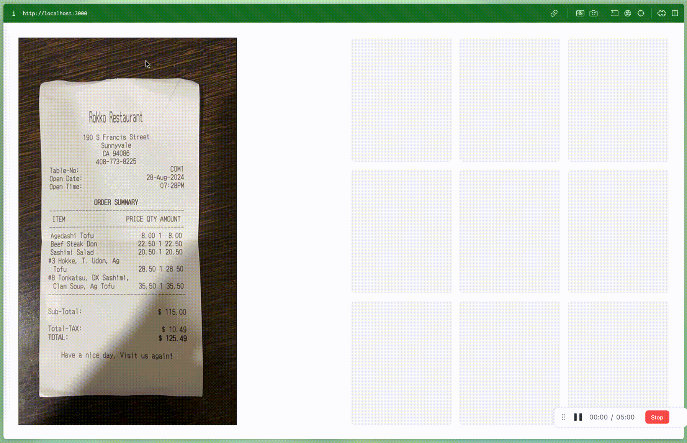

# React Multi Crop Image

A React component that allows users to draw multiple crop regions on an image.

It was built and improved based on [react-multi-crops](https://github.com/beizhedenglong/react-multi-crops).

It has lastest support and more complete functionalities with improved performance

[](https://www.npmjs.com/package/react-multi-crop-image)
[](https://www.npmjs.com/package/react-multi-crop-image)
[](https://github.com/yourusername/react-multi-crop-image/blob/main/LICENSE)
[](https://bundlephobia.com/package/react-multi-crop-image)
[](https://www.typescriptlang.org/)
[](https://github.com/ddx-510/react-multi-crop-image/pulls)




## Installation

```bash
npm install react-multi-crop-image
```

or

```bash
yarn add react-multi-crop-image
```

## Usage

```ts
// src/App.tsx
import React, { useState } from 'react';
import { MultiCrops } from 'react-multi-crop-image';

const App: React.FC = () => {
  const [croppedImages, setCroppedImages] = useState<string[]>([]);
  
  return (
    <div>
      <MultiCrops imageUrl={"YOUR_IMAGE_URL"} setCroppedImages={setCroppedImages} crossOrigin="anonymous" />
      <div>
        {croppedImages.map((image, index) => (
          
        ))}
      </div>
    </div>
  );
};

export default App;
```


# MultiCrops Component

The `MultiCrops` component allows users to create, manage, and export multiple cropped sections from a given image. It's highly customizable, enabling you to style the cropping areas, number icons, and delete icons to fit your application's design.

## Props

| Prop                      | Type                                                                                | Required | Description                                                                                                                                                             |
| ------------------------- | ----------------------------------------------------------------------------------- | -------- | ----------------------------------------------------------------------------------------------------------------------------------------------------------------------- |
| `imageUrl`                | `string`                                                                            | Yes      | The URL of the image to be displayed and cropped.                                                                                                                       |
| `setCroppedImages`        | `React.Dispatch<React.SetStateAction<string[]>>`                                   | Yes      | A state setter function to store the data URLs of the cropped images.                                                                                                   |
| `crossOrigin`             | `"" \| "anonymous" \| "use-credentials"`                                           | Yes      | Specifies the cross-origin behavior of the image. Use `""` for no cross-origin, `"anonymous"` for CORS-enabled images without credentials, or `"use-credentials"` for CORS with credentials. |
| `cropStyle`               | `React.CSSProperties`                                                               | No       | Custom styles to apply to each cropping area. Overrides the default crop styles.                                                                                         |
| `activeCropStyle`         | `React.CSSProperties`                                                               | No       | Custom styles to apply to the currently selected/active cropping area.                                                                                                   |
| `numberIconStyle`         | `React.CSSProperties`                                                               | No       | Custom styles for the number icons displayed within each cropping area.                                                                                                 |
| `deleteIconStyle`         | `React.CSSProperties`                                                               | No       | Custom styles for the delete icons used to remove cropping areas.                                                                                                       |
| `deleteIconContainerStyle`| `React.CSSProperties`                                                               | No       | Custom styles for the container wrapping the delete icons.                                                                                                              |

### Type Definitions

#### Coordinate Type

```ts
interface Coordinate {
  x: number;
  y: number;
  width: number;
  height: number;
  id: string;
}
```

#### `CrossOrigin`

Defines the cross-origin settings for the image.

```ts
type CrossOrigin = "" | "anonymous" | "use-credentials";
```

#### `Point`

Represents a point with `x` and `y` coordinates.

```ts
interface Point {
  x: number;
  y: number;
}
```

## License

MIT


## Changelog

### [1.1.7] - 2025-02-12

#### Fixed
- Fixed the issue where the crop area was not being properly handled when the container was scrollable

### [1.1.6] - 2025-01-21

#### Added
- allow scrollable container
- change crosshair style

### [1.1.5] - 2025-01-17

#### Fixed
- Higher resolution image

### [1.1.4] - 2025-01-15

#### Added
- Readme with demo

### [1.1.3] - 2025-01-14

#### Added
- lodash to improve performance
- new active and inactive management
- new active and inactive crop styles

### [1.1.2] - 2024-11-14

#### Changed
- Better Readme
- Full code refactoring
- Smoother crop area resizing
- Remove unnecessary styles
- Fix delete icon

### [1.0.7] - 2024-11-13

#### Added
- `cropStyle`, `numberIconStyle`, `deleteIconStyle`, `deleteIconContainerStyle` props

### [1.0.5] - 2024-11-13

#### Added
- `onCropComplete` callback with base64 image data
- Better TypeScript type exports
- Additional prop validation

### [Unreleased]
#### Planned
- Touch device support
- Rotation controls
- Aspect ratio constraints
- Custom styling options
- Zoom functionality

## Contributing

Contributions are welcome! Please feel free to submit a Pull Request. For major changes, please open an issue first to discuss what you would like to change.

Please make sure to update tests as appropriate.
